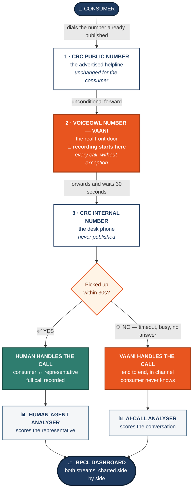

# Vaani for BPCL CRC — Solution Overview

**Client:** Bharat Petroleum Corporation Limited — Bharat Gas / LPG consumer business
**Partner:** VoiceOwl
**Solution:** *Vaani* — a 24×7 voice agent on every CRC office line, with a recording and
call-analysis layer covering both AI-handled and human-handled calls.

---

## The call routing architecture



**Three numbers, one consumer experience.** The consumer dials the number BPCL already advertises.
That number forwards unconditionally into VoiceOwl, which is where recording begins — so **every
call is captured, whether a human or Vaani ends up handling it.** VoiceOwl then rings the CRC desk
for 30 seconds. If a representative picks up, they take the call normally. If not, Vaani takes it.

The consumer never learns that a human was tried first, and the CRC staff never change how they work.

---

## Why BPCL asked for this

A CRC is a BPCL-franchised area office — one per major city, covering many districts and many LPG
distributors. It is where a consumer's problem is supposed to land when their own distributor has not
solved it. By the time someone calls a CRC, they have usually already tried their distributor and
failed.

BPCL identified three blind spots in that channel:

**1 · No visibility into ground-level consumer issues.**
Calls came in, were handled verbally, and left no structured record. BPCL could not answer what
consumers were actually complaining about, or in which district.

**2 · No visibility into CRC representative conduct.**
The offices are franchise-run, so the person answering is not a BPCL employee. Tone, greeting
discipline, whether the consumer's issue was properly captured — none of it was observable.

**3 · No coverage outside office hours, and none at peak.**
Office hours are weekdays 9 am – 7 pm. Calls outside that window went unanswered. At peak, staff
already on a call could not take a second one — and there was no record the call had ever happened.

---

## What we proposed

**Deploy Vaani on every CRC line, 24×7.** She answers what humans cannot: after hours, at weekends,
at peak, and whenever the desk does not pick up.

**Keep humans first.** Vaani is deliberately not the first responder. The CRC representative gets a
30-second first-refusal window on every single call. Vaani is the safety net, not the replacement.

**Record and analyse every call**, human-handled ones included, turning each into a structured,
scored record: what the issue was, which area it belonged to, whether it was resolved, how the
consumer felt, and — on human calls — how the representative performed.

---

## Two analysers, one dashboard

**This is the core of the offering.** Every completed call is analysed after it ends, and **which
analyser runs depends on who answered.** The two streams measure different things because they are
judging different subjects.

| | **AI-handled calls** | **Human-handled calls** |
|---|---|---|
| **Subject** | The conversation and its outcome | The representative |
| **What it captures** | Intent, area, outcome, disposition, consumer sentiment, complaint details, follow-up need | Conduct, tone, greeting, issue containment, consumer effort, escalation risk, satisfaction |
| **Answers** | *What are consumers reporting?* | *How are our representatives performing?* |

### What the human-agent scorecard measures

| Measure | What it tells BPCL |
|---|---|
| **Satisfaction** | How satisfied the consumer was with the interaction |
| **Conversation quality** | The representative's conduct across eight dimensions |
| **Consumer effort** | How hard the consumer had to work to be helped |
| **Escalation risk** | Whether the call carried churn or escalation risk |
| **Tone** | Empathetic · professional · impatient · rude |
| **Greeting** | Whether a proper greeting was given |
| **Containment** | Whether the issue was held and handled rather than deflected |
| **Consumer sentiment** | Positive · neutral · negative · angry |

### Everything lands on a dashboard

Both streams feed a single BPCL dashboard, **presented as charts rather than raw records** — call
volumes by office, who answered what, issue mix by area and district, sentiment trends, coverage by
hour and by day, representative performance by office, and complaint throughput.

Every field carries one fixed type and one closed set of values, so results aggregate cleanly across
offices. AI-handled and human-handled calls are charted **side by side but never averaged together** —
they are different measurements, and merging them would hide exactly the comparison BPCL wants.

---

## How Vaani handles a call

**One triage point, thirteen specialists, one continuous conversation.**
A triage agent identifies what the caller needs, then hands silently to the right specialist —
booking, delivery, payment, subsidy, connection services, new connections, or general enquiries and
complaints — plus a dedicated emergency agent. **The consumer experiences a single, unbroken
conversation.** Handovers are invisible; the agent never refers to teams, departments or transfers.

### The escalation ladder

Every unresolved call follows one path, in order:

```
RESOLVE  →  ROUTE  →  REGISTER A COMPLAINT  →  (only then) CONNECT TO A PERSON
```

- **Resolve** — if the answer is Vaani's to give, she gives it on the call.
- **Route** — if it belongs to another specialist, it moves there, invisibly.
- **Register** — if nothing resolves it, a complaint is opened on the spot, with the number read back
  and confirmed by SMS.
- **Connect** — only if the consumer still wants a person after all of that.

A grievance about something that already happened — a cylinder never delivered, money taken at the
door, staff behaviour — skips straight to registration, because nothing said on the call undoes it
and the complaint *is* the correct resolution.

**The result: 97.7% of calls are handled without transfer** — twenty-two escalations across 971
answered calls, while the network scaled from two offices to nine.

### Safety comes first, always

A confirmed gas hazard overrides every other rule instantly, from any point in the call. While a
hazard is live the agent cannot hand off, cannot end the call, and runs no closing script. The
emergency helpline is given clearly and slowly.

### Discipline built into every call

One question at a time · short, natural turns · the brand always spoken in full · every number read
out digit by digit · nothing invented to fill a gap. If Vaani does not know something, she says so.

---

## Deployment footprint

**Around 70 CRC offices** are in scope nationally, each with its own dedicated VoiceOwl number bound
to that office's own city, address and holiday calendar. **Nine offices are live and carrying traffic
today**, having scaled up from a two-office launch in four weeks.

| Office | Calls | Share |
|---|---:|---:|
| **Delhi** | **900** | 59.7% |
| **Indore** | **416** | 27.6% |
| Goa | 45 | 3.0% |
| Patna | 37 | 2.5% |
| Jabalpur | 31 | 2.1% |
| Prayagraj | 26 | 1.7% |
| Jaipur | 23 | 1.5% |
| Wai | 17 | 1.1% |
| Lucknow | 12 | 0.8% |

**Delhi and Indore carry 87% of all traffic.** The other seven offices are still ramping — the network
has room to grow into capacity that already exists.

**Seven states and union territories** are covered by the nine live offices: Delhi, Madhya Pradesh,
Uttar Pradesh, Goa, Rajasthan, Maharashtra and Bihar.

**Language:** the service runs in a single language today, with multi-language support on the roadmap
as the rollout moves into southern and eastern states.

---

## What the live service is delivering

**1,507 calls** into the network across the nine live offices.

### Who answered

| Answered by | Calls | Share |
|---|---:|---:|
| **Vaani** | **971** | **64%** |
| Human CRC representative | 173 | 11.5% |
| Not connected / incomplete | 363 | 24.1% |

*Not connected / incomplete* — calls hung up by the customer before connecting with either a
representative or Vaani.

> **Vaani carries roughly 5.6× the call volume that the CRC desks do** — on a routing model that
> gives the human representative first refusal on every single call.

### Coverage — the clearest operational change

| | Calls | Answered by Vaani | Answered by a human |
|---|---:|---:|---:|
| **Weekend calls** | 218 | **180** | **0** |

**Across every weekend day since go-live, not one call was answered by a human.** Weekend answering
is Vaani by default. Human representatives were on duty for half the days since go-live, **all of
them weekdays**.

**Vaani keeps the helpline answerable across 16 distinct hours of the day** — a far wider span than
the desk covers. Before this deployment, every call outside that desk window went unanswered and
unrecorded.

### Handling profile

| Measure | Result |
|---|---|
| **Handled without transfer** | **949 · 97.7%** |
| Escalated to a human | **22 · 2.3%** |
| Complaints registered by Vaani | **181** |
| Issues resolved outright | 124 |
| Non-negative sentiment | 649 of 966 · **67.2%** |
| Mean call length | 2 min 56 s |
| Median time for a desk to pick up, when they do | 10.7 seconds |

**Registering a complaint is Vaani's most common successful outcome** — more frequent than outright
resolution. Grievances that previously left no trace now exist as structured, trackable records.

**Escalation stayed rare as the network grew fivefold:** twenty-two transfers across 971 answered
calls, over a period in which the office count went from two to nine and daily volume rose 2.8×.

### What consumers are actually calling about

Across all 971 calls Vaani has answered — **every department area in the catalogue**, not a narrow
subset:

| Area | Calls |
|---|---:|
| **Delivery** | **347** |
| General enquiries | 262 |
| Connection services | 172 |
| Refill | 80 |
| New connection | 57 |
| Payment | 24 |
| Subsidy | 17 |
| Emergency | 7 |

> **Delivery is the problem.** At 347 calls it is comfortably the largest category in the network —
> and exactly the ground-level signal that was previously invisible.

Vaani has taken live calls in **all eight query areas**, so the coverage is complete rather than
concentrated in a few easy intents.

### How consumers arrive

**Two-thirds of calls carry non-negative sentiment (67.2%).** The remaining third arrive negative or
angry — consistent with the CRC being a second attempt after a distributor has already failed them.

---

## The value, in seven lines

1. **Vaani answers 64% of all calls** — 5.6× the volume the CRC desks handle.
2. **Weekends run on Vaani alone** — 180 weekend calls answered, none by a human.
3. **The helpline is answerable across 16 hours a day**, where the desk covers far fewer.
4. **181 complaints registered** — grievances that previously left no record are now trackable.
5. **97.7% of calls handled without transfer** while the network scaled from two offices to nine.
6. **Ground-level issue data now exists where none existed before — and it says *delivery*.**
7. **Representative conduct is measurable for the first time**, charted per office on the dashboard.

---

## Where this goes next

- **Multi-language rollout**, sequenced with the geographic expansion into southern and eastern states.
- **National rollout** across the remaining offices of the roughly 70 in scope.
- **Deeper dashboard analytics** — per-district issue trends, per-office performance comparison, and
  complaint-resolution tracking.
- **Tuning the handover window**, now that real pickup behaviour is measurable.
