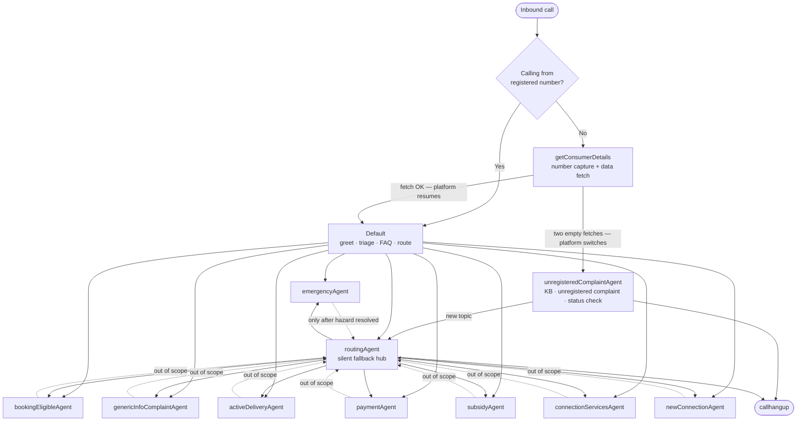

# Vaani — Agent Workflow & Navigation Map

**System:** Bharat Petroleum (Bharat Gas) LPG voice assistant
**Scope:** All 16 prompts in [prompts/](../prompts/) — entry points, routing topology, tools, handoff contract
**Persona:** One voice throughout. The consumer believes they are talking to a single person — "Vaani", an employee of *their own* Bharat Gas distributor office. Agent switching is invisible and must never be revealed.

---

## 1. The system in one picture



**Two hubs, one direction.** `Default` owns the front of the call and triages. Every specialist agent is a leaf: its *only* switch target is `routingAgent`, which re-triages silently and forwards to the correct specialist. No leaf can switch to another leaf, and **nothing ever routes back to `Default`.**

---

## 2. Agent inventory

| # | Agent | File | Role |
|---|---|---|---|
| 1 | `getConsumerDetails` | [getConsumerDetails.txt](../prompts/getConsumerDetails/getConsumerDetails.txt) | Entry for callers not on their registered number. Captures the mobile number, fetches the record; two empty fetches → `unregisteredComplaintAgent` (GCD-06). The only `getConsumerDetails` prompt. |
| 2 | `Default` | [Default.txt](../prompts/Default/Default.txt) | Greeting, emergency detection, FAQ, refill triage, routing. |
| 3 | `routingAgent` | [routingAgent.txt](../prompts/routingAgent/routingAgent.txt) | Silent fallback hub. Classify → switch. Owns out-of-scope hangup. |
| 4 | `emergencyAgent` | [emergencyAgent.txt](../prompts/emergencyAgent/emergencyAgent.txt) | Gas hazards. Owns the call until the consumer is safe. |
| 5 | `bookingEligibleAgent` | [bookingEligibleAgent.txt](../prompts/bookingAgent/bookingEligibleAgent.txt) | Eligible to book, but the attempt failed → suggest a working method. |
| 6 | `bookingNonEligibilityAgent` | [bookingNonEligibilityAgent.txt](../prompts/bookingAgent/bookingNonEligibilityAgent.txt) | Booking blocked (gap, limit, KYC, blocked connection) → explain why. |
| 7 | `activeDeliveryAgent` | [activeDeliveryAgent.txt](../prompts/deliveryAgent/activeDeliveryAgent.txt) | Booking confirmed, delivery pending/late/problem. |
| 8 | `postDeliveryAgent` | [postDeliveryAgent.txt](../prompts/deliveryAgent/postDeliveryAgent.txt) | Cylinder already delivered → post-delivery complaint. |
| 9 | `eligibleDeliveryAgent` | [eligibleDeliveryAgent.txt](../prompts/deliveryAgent/eligibleDeliveryAgent.txt) | No active booking, consumer *is* eligible → "no booking showing", guide to book. |
| 10 | `notEligibleDeliveryAgent` | [notEligibleDeliveryAgent.txt](../prompts/deliveryAgent/notEligibleDeliveryAgent.txt) | No active booking and *not* eligible → explain the reason. |
| 11 | `paymentAgent` | [paymentAgent.txt](../prompts/paymentAgent/paymentAgent.txt) | Failed payment, double charge, refund, overcharging at delivery. |
| 12 | `subsidyAgent` | [subsidyAgent.txt](../prompts/subsidyAgent/subsidyAgent.txt) | Subsidy / DBTL / PAHAL, bank linkage, opt-out disputes. |
| 13 | `connectionServicesAgent` | [connectionServicesAgent.txt](../prompts/connectionServicesAgent/connectionServicesAgent.txt) | KYC, address/name/mobile change, portability, surrender, cylinder return. |
| 14 | `newConnectionAgent` | [newConnectionAgent.txt](../prompts/newConnectionAgent/newConnectionAgent.txt) | New connection, Ujjwala/PMUY, documents, onboarding. |
| 15 | `genericInfoComplaintAgent` | [genericInfoComplaint.txt](../prompts/genericInfoComplaint/genericInfoComplaint.txt) | Catch-all: booking/delivery how-to, equipment faults, behaviour complaints. |
| 16 | `unregisteredComplaintAgent` | [unregisteredComplaintAgent.txt](../prompts/unregisteredComplaintAgent/unregisteredComplaintAgent.txt) | A consumer with no record: answers from its knowledge base, registers via `bpcl_create_unregistered_complaint`, checks an earlier complaint's status. Reached only from `getConsumerDetails` (UNREG-03). |

---

## 3. Entry: which agent picks up the call

The caller's number decides the entry point.

**Registered caller** → straight to `Default`. Consumer data is pre-injected; no lookup happens.

**Caller not on their registered number** → `getConsumerDetails` first (one prompt, CHANNELS.md GCD-06):

1. Ask for the 10-digit registered mobile number. "No registered number" or a refusal is asked again for any number the consumer uses.
2. `validatecontactno` collects and validates it (digits only; never a caller-ID or injected number).
3. Confirm the number back **exactly once**. Any affirmative locks it.
4. `bpcl_fetch_all_api` with that confirmed number — **the only place in the whole system this tool is legitimately called.**
5. **Data found** → job done, stop speaking. The platform resumes the call into `Default`.
   **First empty fetch** → one request for a different registered number, then the loop again; a consumer with no second number has the first one fetched again, silently.
   **Second empty fetch** → the agent says **nothing**. The platform activates `unregisteredComplaintAgent`.
6. `unregisteredComplaintAgent` takes the issue from `{{handoffSummary}}` (Default's), else from the earlier transcript, else one question; answers from its knowledge base; registers via `updateContact` → `get_pincode_data` → confirmed district → `bpcl_create_unregistered_complaint`; checks an earlier complaint's status (CST-01); transfers per T1–T4; switches only to `routingAgent`, only for a new topic after its own work is done; otherwise closes with `callhangup`.

> ⚠️ `getConsumerDetails` has **no `switchagent`, no `calltransfer` and no `callhangup`.** Both of its exits — into `Default` and into `unregisteredComplaintAgent` — are owned by the platform. These are the two transitions in the system that no prompt describes.

---

## 4. `Default` — the triage machine

`Default` is a strict stage machine. Every turn: run the Stage 0 interrupts first; only if none fire, act in the numbered stage the transcript places you in.

### Stage 0 — interrupts (checked every turn, first match wins)

| | Interrupt | Action |
|---|---|---|
| **A** | **Gas hazard** — leak, smell, fire, hissing, explosion, spark, smoke | → `emergencyAgent` immediately. The words "emergency"/"urgent" *alone* are not a hazard — ask once: "क्या सिलेंडर से गैस लीक हो रहा है?" |
| **B** | Human / agent / specialist requested | **Switch via STAGE 3** to `genericInfoComplaintAgent` — `Default` holds no complaint tool, so it routes for the complaint to be registered there. Silent; the consumer never learns of it. |
| **C** | Language other than Hindi requested | **Inline, one line only** — "मैं सिर्फ़ Hindi में मदद कर सकती हूँ।", and keep replying in Hindi. Escalates like B only if the consumer repeats it on the very next turn. |
| **D** | Non-LPG Bharat Petroleum product (petrol, diesel, lubricants…) | **Inline, one line only** — "मैं सिर्फ़ LPG से जुड़े सवालों में मदद कर सकती हूँ।" Never merged with the C line. Escalates like B only on insistence. |
| **E** | Callback requested | **Switch via STAGE 3**, same as B. No callback is ever scheduled — the complaint is what reaches the team. |

Interrupts B and E use the **COMPLAINT ESCALATION** path (CHANNELS.md ESC-01): register a complaint and tell the consumer our team will make contact. **There is no office-visit escalation** — the consumer has usually already tried their distributor before calling a CRC, and one CRC covers a whole multi-district territory, so a visit can mean a 100+ km trip. Addresses and phone numbers are knowledge Vaani holds and speaks **only when asked**, plus the two physical carve-outs that genuinely need a counter: buying a hotplate/stove and submitting KYC documents.

### Numbered stages

| Stage | You are here when | Action |
|---|---|---|
| **1** | Not yet greeted | Speak the greeting verbatim. Never greet twice. |
| **2** | Greeted, intent unclear | Capture intent. **Max one clarifying question.** Still unclear → `routingAgent`. |
| **2B** | Intent is booking / delivery / payment | **Refill triage** — max 2 classification questions, then route. |
| **2.5** | Intent is a general FAQ (*not* booking/delivery/payment) | Answer directly from the knowledge base, 2–3 sentences. |
| **3** | Intent needs an agent | `switchagent` once, with `handoffSummary`. Done. |

### Stage 2B — refill triage (the core decision)

Every booking, delivery, and payment query goes through here. `Default` never answers these itself.

| Consumer situation | Destination |
|---|---|
| Tried to book, it failed / errored / was rejected | `bookingEligibleAgent` |
| Booked, **got confirmation**, cylinder not arrived / late / problem with *this* delivery | `activeDeliveryAgent` |
| Booked, **no confirmation**, doesn't know if it worked | `bookingEligibleAgent` *(booking verification, not delivery)* |
| Money issue — deducted, double-charged, refund, overcharged at the door | `paymentAgent` |
| General how-to, equipment fault, recurring/behaviour complaint | `genericInfoComplaintAgent` |

**Overlap rules — these decide the ambiguous cases:**

- Payment **+** booking ("पैसे कट गए पर booking नहीं हुई") → **`paymentAgent`.** Money wins.
- Booking **+** delivery ("booking की थी पर नहीं आया") → ask *one* question: was a confirmation received? **Yes → `activeDeliveryAgent`. No/unknown → `bookingEligibleAgent`.**
- Delivery person demanded **money** → **`paymentAgent`** (not delivery).
- Delivery person was **rude, this delivery** → `activeDeliveryAgent`.
- Delivery person is **always** rude / never door-delivers → `genericInfoComplaintAgent`. *(Recurring ≠ active.)*

### Stage 2 special cases

- **New connection** — any clear "नया कनेक्शन" → `newConnectionAgent` **directly.** No gate, no FAQ, no questions first.
- **Surrender** — ambiguous. Clarify once: connection surrender vs. cylinder return. Both → `connectionServicesAgent`.
- **Ambiguous "new"** — "नया सिलेंडर" usually means a *refill*, not a connection. Clarify once, unless the word "कनेक्शन" is present.
- **Hotplate/stove purchase** — answered inline (Stage 2.5) with office details and the ₹1,500–4,000 range. This is one of the two carve-outs where office guidance is still correct: a complaint cannot sell a hotplate. A *faulty* stove is a complaint → `genericInfoComplaintAgent`.
- **Competitor mention** ("मैं HP में जाऊँगा") — this is venting, not a competitor query. Empathise, find the real LPG issue.

> **Hard rule across all of Stage 2/3:** never collect factual details before routing. No dates, amounts, quantities, or reference numbers. Switch with only what the consumer volunteered — the downstream agent gathers the rest. (Stage 2B triage questions are the sole exception: they classify, they don't gather.)

---

## 5. `routingAgent` — the silent hub

Every specialist's escape hatch. It is **invisible**: the previous agent already said "details देखती हूँ", so the consumer is mid-wait.

**Mode A — silent route (default).** Text = `"."`, `preToolMessage = "."`, consumer hears nothing. Used whenever intent is classifiable.

**Mode B — spoken (exception only).** Ambiguous intent, out-of-scope handling, non-LPG redirect, partial speech. Max 2 clarification attempts.

**Out-of-scope ladder** — the only place in the system authorised to hang up on an unresolved call:

1. Attempt 1 — "मैं इस विषय में सहायता नहीं कर सकती।" + ask for their LPG issue.
2. Attempt 2 — *different phrasing* + ask again.
3. Attempt 3 — ask once more → speak the exact closing line → `callhangup`.

A valid LPG intent at **any** point aborts the ladder and routes silently.

`routingAgent` never handles emergencies inline (switches to `emergencyAgent`), never fetches data, and never routes to `Default` or back to itself.

---

## 6. `emergencyAgent` — the one agent that owns the call

Entered on a confirmed gas hazard. While a hazard is active it has **no exits**: it cannot hang up, cannot switch, and has no closing sequence. It stays on the line until the consumer confirms they are safe.

- Helpline **1906**, always spoken digit by digit: `one - nine - zero - six`.
- Safety steps one per turn: open windows → no switches/flames → regulator off.
- Its only tool is `switchagent`, and only to `routingAgent`, and only **after** the hazard is resolved (or proved a false alarm) **and** the consumer raises a different LPG query.

---

## 7. Delivery & booking variants — selected by state, not by name

This is the subtlest part of the system. `Default` and `routingAgent` only ever *name* `bookingEligibleAgent` and `activeDeliveryAgent`. The other four prompts are **never a switch target of any router.**

They are backend-state variants, resolved by the platform from the consumer's refill status:

| Family | Consumer state | Prompt |
|---|---|---|
| **Booking** | Eligible, but the booking attempt failed | `bookingEligibleAgent` |
| | Booking blocked — gap not met, limit hit, KYC, blocked connection | `bookingNonEligibilityAgent` |
| **Delivery** | Booking confirmed, delivery in progress or late | `activeDeliveryAgent` |
| | Already delivered — complaint about the delivery that happened | `postDeliveryAgent` |
| | No active booking, consumer *is* eligible to book | `eligibleDeliveryAgent` |
| | No active booking, consumer is *not* eligible | `notEligibleDeliveryAgent` |

Corroborated by [customerStatus-spec.md](customerStatus-spec.md) §2, which injects `{{customerStatus}}` into exactly the state-dependent variants (`bookingNonEligibilityAgent`, `activeDeliveryAgent`, `postDeliveryAgent`) and **not** into the ones that don't need to read booking state (`bookingEligibleAgent`, `eligibleDeliveryAgent`, `notEligibleDeliveryAgent`).

The spec makes the contract explicit (§4.6): *"the platform must not route to `bookingEligibleAgent` while the blob says the consumer is not eligible to book."*

---

## 8. Tools — who can call what

| Agent | switchagent | callhangup | complaint tool | data lookup |
|---|:---:|:---:|:---:|:---:|
| `getConsumerDetails` | — | — | — | `validatecontactno` + `bpcl_fetch_all_api` |
| `unregisteredComplaintAgent` | ✅ *(→ routingAgent only)* | ✅ | `bpcl_create_unregistered_complaint` + `bpcl_complaint_status` | — |
| `Default` | ✅ | — | — | ❌ blocked |
| `routingAgent` | ✅ | ✅ *(OOS only)* | — | ❌ blocked |
| `emergencyAgent` | ✅ *(post-hazard)* | — | — | — |
| `bookingEligibleAgent` | ✅ | ✅ | `bpcl_create_complaint` + `bpcl_complaint_status` | — |
| `bookingNonEligibilityAgent` | ✅ | ✅ | `bpcl_create_complaint` + `bpcl_complaint_status` | — |
| `activeDeliveryAgent` | ✅ | ✅ | `bpcl_create_complaint` + `bpcl_complaint_status` | — |
| `postDeliveryAgent` | ✅ | ✅ | `bpcl_create_complaint` + `bpcl_complaint_status` | — |
| `eligibleDeliveryAgent` | ✅ | ✅ | `bpcl_create_complaint` + `bpcl_complaint_status` | — |
| `notEligibleDeliveryAgent` | ✅ | ✅ | `bpcl_create_complaint` + `bpcl_complaint_status` | — |
| `paymentAgent` | ✅ | ✅ | `bpcl_create_complaint` + `bpcl_complaint_status` | — |
| `subsidyAgent` | ✅ | ✅ | `bpcl_create_complaint` + `bpcl_complaint_status` | ❌ blocked |
| `connectionServicesAgent` | ✅ | ✅ | `bpcl_create_complaint` + `bpcl_complaint_status` | ❌ blocked |
| `newConnectionAgent` | ✅ | ✅ | — | ❌ blocked |
| `genericInfoComplaintAgent` | ✅ | ✅ | `bpcl_create_complaint` + `bpcl_complaint_status` | — |

Notes worth knowing:

- **`bpcl_fetch_all_api` is callable by `getConsumerDetails` and nothing else.** Every other prompt that mentions it does so in an explicit *tool blocker* forbidding the call — their data is pre-injected.
- **Neither `Default` nor `emergencyAgent` can end a call.** Hangup is a leaf/`routingAgent` privilege.
- **Eleven agents hold `bpcl_complaint_status`** (CHANNELS.md CST-01): the ten below plus `unregisteredComplaintAgent`. It reads what has happened to an earlier complaint from the number the consumer gives, before anything is registered again. `Default` and `routingAgent` never check a status; they route a follow-up by its problem.
- **Ten agents hold `bpcl_create_complaint`** and register in place. Three never get it: `Default` (triage only — it escalates via STAGE 3 to `genericInfoComplaintAgent`), `newConnectionAgent` (escalates `→ routingAgent → genericInfoComplaintAgent`, since leaf-to-leaf switching is forbidden), and `getConsumerDetails` (no record exists yet, so there is nothing to attach a complaint to).
- **`bookingEligibleAgent` registers its own complaints** as of 2026-07-29 (CHANNELS.md CPL-02). A booking that failed across two or more methods is a technical fault on our side, so the complaint is the **first** action; the distributor's phone number is only ever offered afterwards, as a convenience for a consumer who still wants to book today.

### Complaint discipline (shared across every agent that has the tool)

Every agent holding the tool carries the same `COMPLAINT PROTOCOL — STANDARD` block, byte-identical across the channel (CHANNELS.md CPL-01). A complaint is the **last** option: the `RESOLUTION LADDER` runs first — understand → resolve if it is yours → route if it is another domain's → only then register; a **grievance about something that already happened** skips the ladder and registers directly (CPL-04). Confirmation covers **only what is new and consequential**, and when the issue is clear the summary rides inside the registering line instead of costing a turn (CPL-05). The agent then **speaks that line and invokes the tool on the same turn** — the platform registers nothing on its own, and a registering line spoken with no tool call is a **failed turn** to be recovered on the next turn, with no number spoken (CPL-03). Never say "register कर दी है" before the tool has actually returned success. Call **once per complaint**, **max 2 per call**, never retry on failure. On success the number is spoken **digit by digit in Hindi words**, with the SMS line and "हमारी team आपसे संपर्क करेगी". On failure the only correct line is "माफ़ कीजिए! अभी complaint register करने में तकनीकी समस्या आ रही है। कृपया थोड़ी देर बाद call कीजिए।" — never a retry, never an office visit, never an invented number.

---

## 9. The handoff contract

Every `switchagent` call carries the same three parameters.

```
agentName      = the destination
handoffSummary  = "Intent: [INTENT]. Context: [ONLY IMPORTANT FACT]. Please help consumer with [NEXT_ACTION]."
preToolMessage  = "."          ← always a literal period
```

**`handoffSummary` rules.** One plain-English line. No emotional filler, no full history, no raw API responses, no unrendered variables, no mobile number, no consumer identifier. If a `contactNumber` was present on the way in, it must be carried forward unchanged so the next agent doesn't re-ask for it.

`routingAgent` additionally: pass the summary through **unchanged** on a direct match; rewrite **only** the `Intent:` field if a clarification was needed.

### The tool-turn rule (the double-speak fix)

On a tool turn, exactly one thing speaks.

> Write the natural Hindi line as **regular text**. Set `preToolMessage = "."`. The platform suppresses the period, so the consumer hears the text once.

Putting a sentence in `preToolMessage` **and** generating text makes the consumer hear both lines. That is the bug this rule exists to prevent.

The spoken line must sound like Vaani is personally checking something — "ज़रा booking system check करती हूँ, एक मिनट।" It must never reveal the switch. **Forbidden words:** transfer, connect, specialist, agent, team, switch, handoff, forward, भेजती, जोड़ती.

**One exception:** `getConsumerDetails` speaks on no tool turn at all. `validatecontactno` and `bpcl_fetch_all_api` are invoked silently, with no text and no `preToolMessage`, and Vaani speaks only after a Result. It holds no `callhangup` (GCD-06).

---

## 10. Rules that hold everywhere

- **Switching is invisible.** Never reveal that other agents, experts, teams, or systems exist. One Vaani, one call.
- **Vaani works *at* the consumer's own distributor office.** Insider language — "हमारा office", "हमारे यहाँ" — never "आपके distributor" as if it were a third party.
- **The complaint comes first; a transfer only after it. No callbacks, no office-visit escalation.** A request for a human or a callback first becomes a **registered complaint**, with the number read back digit by digit and "हमारी team आपसे संपर्क करेगी" — no timeframe promised, no slot captured. **Only if the consumer still wants a person after that** does the agent call `calltransfer` itself, passing `preToolMessage: "आपकी कॉल ट्रांसफर की जा रही है।"` as its only parameter and speaking no text of its own (CHANNELS.md XFER-03, 2026-08-11 — there is no `callTransferAgent` and nothing to switch to). A non-Hindi or non-LPG request gets one separate inline line each, and becomes a complaint only if repeated on the very next turn.
- **Brand is always "Bharat Petroleum" in full.** Never "BPCL".
- Hindi only, 1–2 sentences per turn, one question per turn. FAQs 2–3 sentences.
- Never speak a raw digit, a `{{variable}}`, or a placeholder. Numbers go digit by digit; dates in `{{customerStatus}}` are **day-first** (`03-07-2026` = 3 July).
- Never say **"टंकी"**. Never say **"जोड़"** (TTS mispronounces it) — use "connect".
- Curly braces still visible in a variable = **no data**. Treat as absent; never speak it.

---

## 11. Known gaps in the current prompts

Findings from reading the prompts against each other. Each is a real inconsistency, not a design choice.

1. **`deliveryGenericAgent` does not exist.** `routingAgent` lists it in its `agentName` enum and gives it a full routing block ([routingAgent.txt:63](../prompts/routingAgent/routingAgent.txt#L63), [:132](../prompts/routingAgent/routingAgent.txt#L132)) for generic delivery questions. There is no such prompt file. `Default` sends exactly those queries to `genericInfoComplaintAgent` instead. **A generic delivery question reaching `routingAgent` will be routed to a non-existent agent.**

2. **`refillSupportAgent` does not exist.** Named as a routing destination in [connectionServicesAgent.txt:224](../prompts/connectionServicesAgent/connectionServicesAgent.txt#L224) and [newConnectionAgent.txt:2027](../prompts/newConnectionAgent/newConnectionAgent.txt#L2027) for refill/booking/delivery/payment topics. No such file. (Mitigated in practice: both agents may only switch to `routingAgent`, so the name is misleading guidance rather than a live break.)

3. **The `getConsumerDetails` hops are undocumented.** `getConsumerDetails` has no `switchagent` tool: on data found its prompt just says "your job is done: stop speaking", and after two empty fetches it goes silent. Nothing in any prompt states how the call reaches `Default` or `unregisteredComplaintAgent`. It works only if the platform owns that transition — worth confirming with the platform team.

4. **Four prompts are unreachable by name.** `bookingNonEligibilityAgent`, `postDeliveryAgent`, `eligibleDeliveryAgent`, and `notEligibleDeliveryAgent` are never a `switchagent` target anywhere. They only work if the platform resolves the family name (`bookingEligibleAgent` / `activeDeliveryAgent`) to the right variant using backend state. If it does not, a not-eligible consumer lands in `bookingEligibleAgent`, which is hard-coded to open with *"the system confirms you can book"* — the exact contradiction [customerStatus-spec.md](customerStatus-spec.md) §4.6 warns against.
